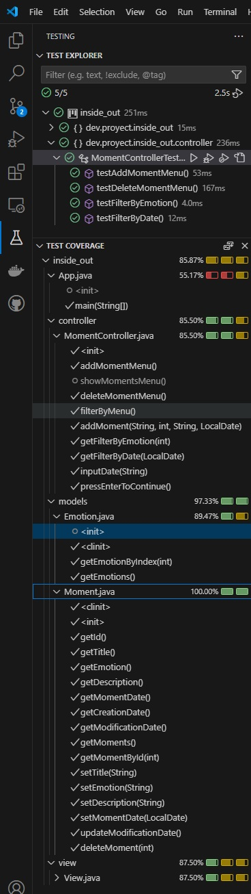
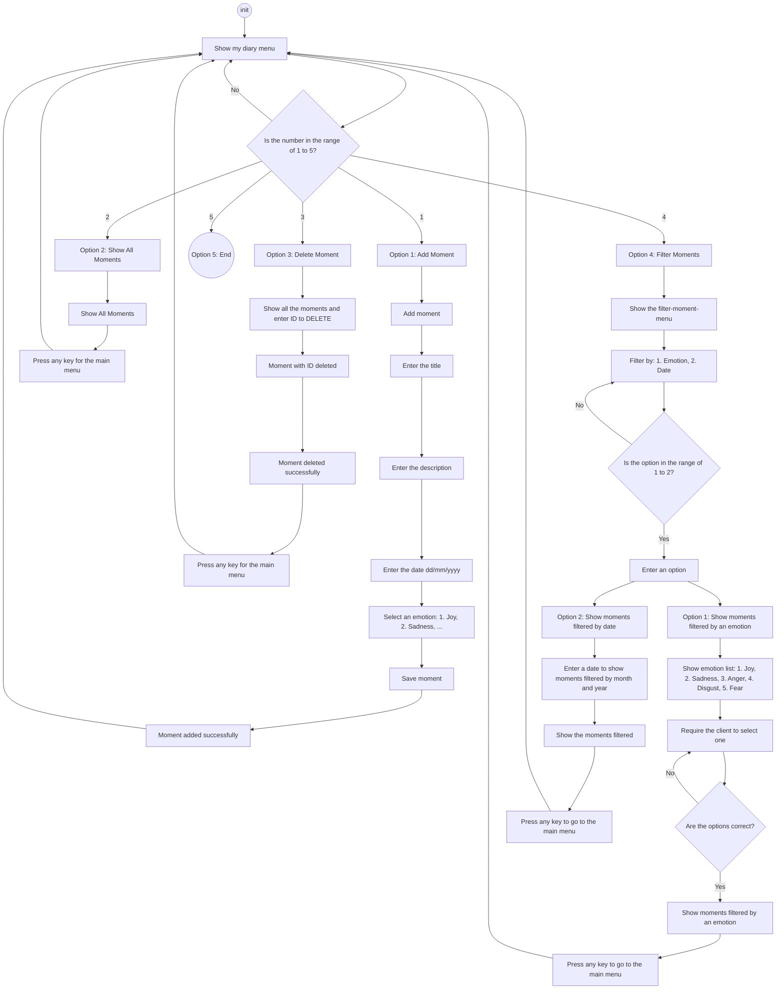
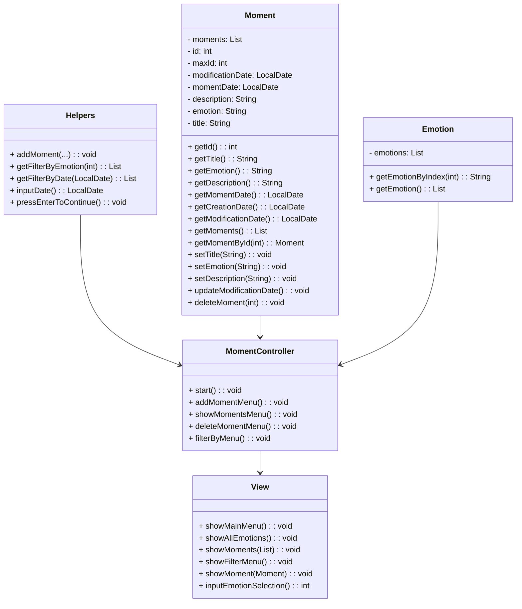

# Inside_out

Inside Out is a console application designed to help users manage memorable moments they’ve experienced, called "My Diary". Each moment has an assigned emotion, a date, and details about the event. Users can add, view, delete, and filter moments based on their emotions or the date.

## Table of Contents

- [Prerequisites](#prerequisites)
- [Installation](#installation)
- [Running Tests](#running-tests)
- [Diagrams](#diagrams)
- [User Stories and Acceptance Criteria](#User-Stories-and-Acceptance-Criteria)
- [Example Console Interaction](#Example-Console-Interaction)
- [Authors](#authors)
- [Additional Resources](#Additional-Resources)

## Prerequisites

To run this project, you need to have the following installed:

- [Java Development Kit (JDK)](https://www.oracle.com/java/technologies/javase-downloads.html) (version 11 or higher).
- [JUnit](https://junit.org/junit5/) for running tests.
- [Hamcrest](http://hamcrest.org/JavaHamcrest/) for flexible assertions in tests.
- [Maven](https://maven.apache.org/) for dependency management and build tasks.
- [Jira](https://www.atlassian.com/software/jira) for management.

## Installation

Follow these steps to set up and run the project locally:

1. Clone the repository:
  ```bash
    git clone https://github.com/abdiaslabrador/inside_out.git
  ```
2. Navigate to the project folder:
  ```bash
    cd inside_out
  ```
## Running Tests
To run tests and check code coverage:

Execute the following command:
  ```bash
  java -jar target/AppTest.jar
  ```
This command will generate a coverage report.



Example Test Code

```java
import org.junit.jupiter.api.Test;
import static org.hamcrest.MatcherAssert.assertThat;
import static org.hamcrest.Matchers.*;

public class MomentTest {
    @Test
    public void testAddMoment() {
        Moment moment = new Moment("Happy Day", "A day at the park", "Joy", LocalDate.of(2024, 5, 1));
        assertThat(moment.getTitle(), is("Happy Day"));
        assertThat(moment.getEmotion(), is("Joy"));
    }
}
```

## Diagrams

Activity diagram

Classes

## User Stories and Acceptance Criteria
User Stories:
As a user, I want to add a memorable moment so that I can view it whenever I want to remember it.
As a user, I want to retrieve a list of all recorded moments so that I can review them.
As a user, I want to delete a memorable moment to avoid duplicates and keep my list organized.
As a user, I want to filter moments by emotion so that I can view specific types of moments.
As a user, I want to filter moments by month so that I can see moments from a specific time period.
As a user, I want to exit the program so that I can start a new task.

## Example Console Interaction
```plaintext
My Diary:
1. Add Moment
2. View All Moments
3. Delete a Moment
4. Filter Moments
5. Exit
Select an option: 1

Enter the title: A day at the amusement park
Enter the date (dd/mm/yyyy): 01/05/2024
Enter the description: A fun day with family and friends.

Select an emotion:
1. Joy
2. Sadness
3. Anger
4. Disgust
5. Fear
6. Anxiety
7. Envy
8. Shame
9. Boredom
10. Nostalgia
Enter your choice: 1
Moment added successfully.
```

## Authors
Olena Myroshnykova, Abdias Labrador, Oleg Poberezhets, Ana Tovar

## Additional Resources

- [Original GitHub Repository](https://github.com/abdiaslabrador/inside_out.git)
- **Forks from Teammates**
  - [Olena Myroshnykova Fork](https://github.com/OlenaMyroshnykova/inside_out.git)
  - [Oleg Poberezhets Fork](https://github.com/olegukr/inside_out.git)
  - [Ana Tovar Fork](https://github.com/AnaTovar-Arg/inside_out.git)
- [Project Presentation](https://docs.google.com/presentation/d/17JxhAYAV8vvo8Cg6Y_QzmZ98Du9GujokvZbwcxCCriw/edit#slide=id.g1f87997393_0_782)
- [Jira Board](https://olegpoberezhets.atlassian.net/jira/software/projects/SCRUM/boards/1)
