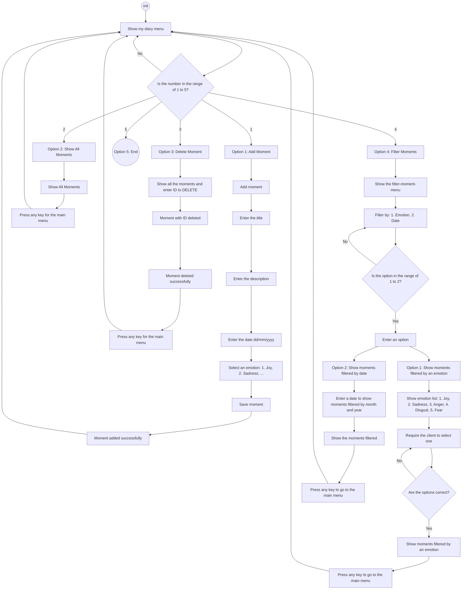
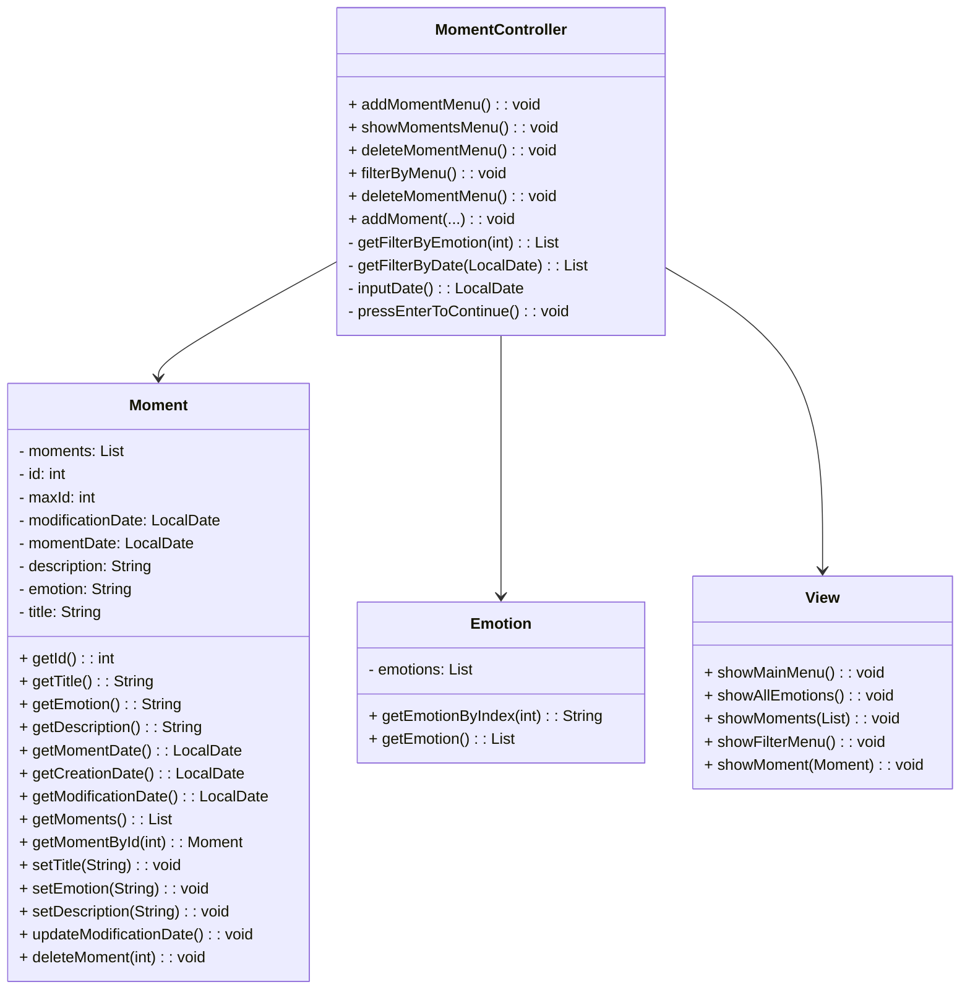

# Inside_out

## Table of Contents

- [Prerequisites](#prerequisites)
- [Installation](#installation)
- [Running Tests](#running-tests)
- [Diagrams](#diagrams)
- [Authors](#authors)

## Prerequisites

To run this project, you need to have the following installed:

- [Node.js](https://nodejs.org/) (version 20 or higher)
- [npm](https://www.npmjs.com/) (typically installed with Node.js)
- Other dependencies listed in `package.json`

## Installation

Follow these steps to set up and run the project locally:

1. Clone the repository:
  ```bash
    git clone https://github.com/OlenaMyroshnykova/inside_out.git
  ```
2. Navigate to the project folder:
  ```bash
    cd inside_out
  ```
## Running Tests
To run tests and check code coverage:

Execute the following command:
  ```bash
  npm test
  ```
This command will generate a coverage report (consider adding a screenshot or link to coverage details here if needed).

## Diagrams

Activity diagram

Classes

## Authors
Olena Myroshnykova, Abdias Labrador, Oleg Poberezhets, Kari Tovar
